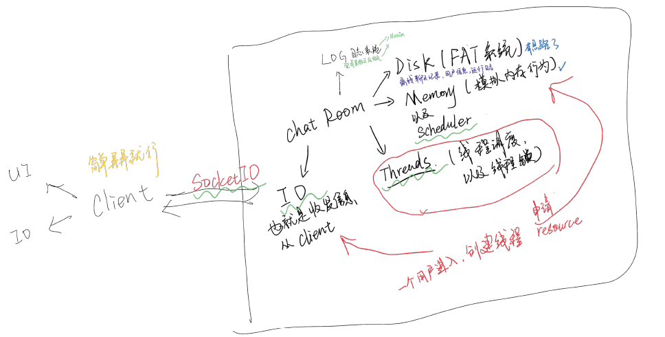
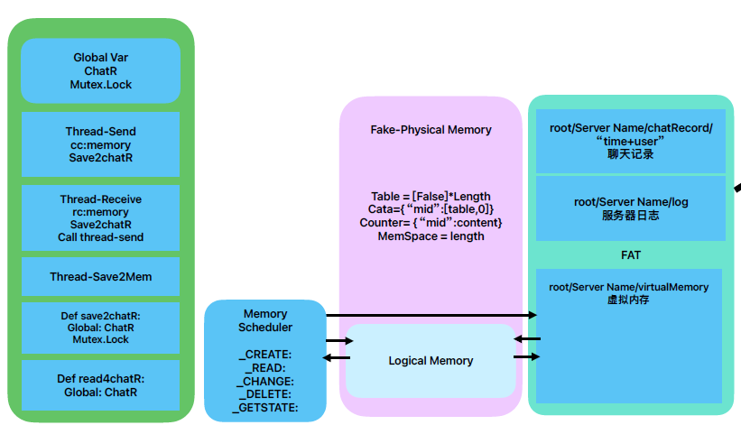
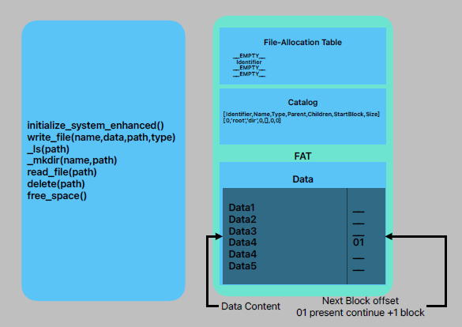

# OSproject-WebChatRoom-PyQt-Flask-Manim
 OSproject-WebChatRoom-PyQt-Flask-Manim

### 项目介绍
该项目指在OS课程中，实现一个基于PyQt5的Web聊天室，同时实现一个基于Flask的Web聊天室，以及一个基于Manim的动画演示。
通过该项目，可以学习到PyQt5、Flask、Manim的基本使用方法，以及操作系统的一些基本概念。
代码能力复健用。

在中文互联网上流传着这么一句话“不要重复造轮子”，但是今天我们的理念是try to make a wheel。
尽管我们的wheel目前还无法独立工作，但是在这个项目完成之后，对于造一个真正的轮子也有了不少见解。

整个项目是自上而下自下而上step-wise同时进行的。首先我们进行了顶层设计，也就是实现一个可以运行的chatRoom，
我们简单分为了三个部分，UI，Server，以及wheel。他们相辅相成。

首先，我将按照实现顺序来介绍我们的项目。
我们在这节课上

### 项目结构

FAT结构
>   

## Learning Line
- [ ] PyQt5
- https://www.bilibili.com/video/BV12B4y1h7QX/?spm_id_from=333.788.recommend_more_video.0&vd_source=2755821873fe338531f662ab376e426b
- https://www.bilibili.com/video/BV14g411h7cQ/?spm_id_from=autoNext&vd_source=2755821873fe338531f662ab376e426b
- [ ] Flask
- https://chat.openai.com/share/0819f6a2-3601-4a1a-831f-2028db982e8d
- [ ] Manim
- https://chat.openai.com/share/afb47da5-b8f5-4f92-b136-71307050a7d9

### 完成情况

- [x] Memory Sim
  - [x] MemoryScheduler 13.12.2023
  - [x] MemorySim 10.12.2023 - 13.12.2023
  - [x] VmemSim   10.12.2023 - 13.12.2023
- [x] File System Sim - FAT
  - [x] Feature - 10.12.2023
    - [x] Limited Space 
    - [x] Less search operation
    - [x] Offline availble
  - [ ] Function - 11.12.2023
    - [x] Write
    - [x] mkdir
    - [x] ls
    - [x] read
    - [x] delete
    - [ ] move
- [ ] thread system Sim
- [ ] ChatRoom Server
  - [X] 服务端客户端可连接，发送消息
  - [X] 记录聊天记录并同步以及保存。

### 参考内容

1. CSS cheatsheet: https://htmlcheatsheet.com/css/
2. 【Python 实现操作系统模型 [南京大学2023操作系统-P4] (蒋炎岩)】  https://www.bilibili.com/video/BV1Zb411D7jE/?share_source=copy_web&vd_source=da0575add73694307a909c8c9c1845e9&t=4040
3. FAT
    1. Operation System Concepts chap13 - 14: https://os-book.com/OS10/slide-dir/index.html
    2. An Overview of FAT12: https://oriont.net/posts/fat12-overview
    3. Design of the FAT file system, wikipedia: https://en.wikipedia.org/wiki/Design_of_the_FAT_file_system
4. Threading
   1. 【100秒学会Python多线程threading-哔哩哔哩】 https://b23.tv/HmynWaA
   2. 【用Python实现创建多线程，使程序执行速度更快，超细致讲解，快收藏！（上篇）-哔哩哔哩】 https://b23.tv/m5UG1Hx
   3. 【python 多任务 进程 线程 进程池 互斥锁 队列-哔哩哔哩】 https://b23.tv/0ewf2bt

##### 可以用来巩固知识的内容

1. 【分段、分页和虚拟内存 操作系统OS 国外优质讲解，清晰易懂！！！1】 https://www.bilibili.com/video/BV1ws4y1k7xp/?share_source=copy_web&vd_source=da0575add73694307a909c8c9c1845e9
2. 【操作系统原理(合集)】 https://www.bilibili.com/video/BV13b4y1Q7YD/?p=4&share_source=copy_web&vd_source=da0575add73694307a909c8c9c1845e9
3. 【爆肝一晚上，希望用动画带你理解操作系统的启动】 https://www.bilibili.com/video/BV1mm4y1u7G6/?share_source=copy_web&vd_source=da0575add73694307a909c8c9c1845e9
4. 【一个视频告诉你“并发、并行、异步、同步”的区别】 https://www.bilibili.com/video/BV17V411e7Ua/?share_source=copy_web&vd_source=3bb91ad92758e79e1abca697cd2e24bb

#### 在项目中得到的一些启发
1. FAT
   1. 读取文件时
   2. 删除文件时
       1. 当删除catalog中目标行时，有两种方案可以选择
           1. 替换当前行为/n (本项目选择此处理方法)
              1. 优点：不需要移动后面的行，在删除时效率高
              2. 缺点：需要在读取时判断当前行是否为/n，如果是则跳过，增大了读取时的复杂度
           2. 删除当前行，让后面的行前移
              1. 优点：创建新文件时不需要判断当前行是否为/n，减小了创建时的复杂度，不需要在每次创建时都要遍历整个catalog直到第一个/n
              2. 缺点：删除时需要移动后面的行，效率较低，并且在删除时，需要考虑其他行中是否有删除行后的索引，如果有则需要全部更新
                 - 还有一点不确定的是，如果移动后面的行，是否也增加了更多的操作
2. 学会写测试函数，太重要了。。。
3. 多线程
   1. 线程一定要命名
   2. 对于辅助用线程可以使用daemon=True，这样当主线程结束时，辅助线程也会结束
   3. 线程的join()方法，可以让主线程等待辅助线程结束后再结束
   4. 对于多个线程同时操作一个变量时，一定要加锁，否则会出现数据不一致的情况
      1. 例如在FAT中，多个线程同时操作catalog时，会出现数据不一致的情况
      2. 例如在聊天室中，多个线程同时操作聊天记录时，会出现数据不一致的情况
      3. 